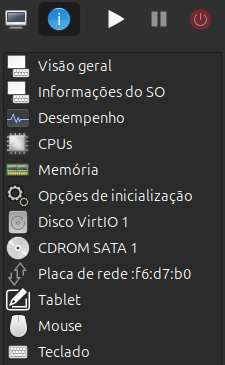
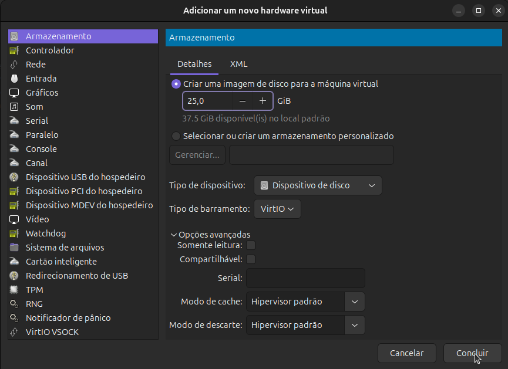
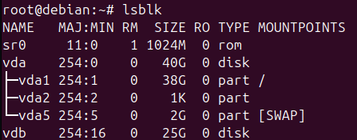

# LFS Vinux
Um sistema LFS (Linux From Scratch) compilado do zero. O objetivo do projeto é aprender na pratica como o ambiente Linux opera na base, entendendo como é contruido e levado à produção.

## Ambiente utilizado:

Host: Debian 13 virtualizado com Virtual Machine Maneger.
Arquitetura do sistema: x86_64.
CPU: 1 soquet - 8 núcleos - 1 thread por núcleo.
RAM: 8GiB alocados - 2333Hz.
Armazenamento: host debian - 40Gib - Partição única | Partição externa 25Gib - 23Gib para sistema - 2Gib para Swap.
Boot: Legacy BIOS.

## Sistema objetivo:
Versão do manual LFS: ✔️ Linux From Scratch 12.2 (stable).
Filesystem: etx4.
Init system: SysVinit.
Kernel: 6.
Toolchain: Modern GCC.
Segurança implementada: Hardened flags custom.

### Capítulo 2 do Manual LFS - Preparação do HOST.

Nessa etapa a primeira coisa que fiz foi rodar o script de verificação ligeiramente adaptado para validar alguns componentes essenciais para a compilação do sistema.

Ao invés de rodar direto no EOF, decidi criar manualmente o arquivo via nano afim de não deixar a tela poluida.

```
#!/bin/bash
# Script de verificação de versões - LFS (Linux From Scratch)
export LC_ALL=C

# Bash
bash --version | head -n1 | cut -d" " -f2-4

# /bin/sh
MYSH=$(readlink -f /bin/sh)
echo "/bin/sh -> $MYSH"
if [ "$MYSH" != "/usr/bin/bash" ] && [ "$MYSH" != "/bin/bash" ]; then
  echo "ERRO: /bin/sh deve ser um link simbólico para o bash"
fi

# Binutils
ld_ver=$(ld --version 2>/dev/null | head -n1 | grep -oP '\d+\.\d+' | head -n1)
required="2.43"
if [ "$(printf '%s\n' "$required" "$ld_ver" | sort -V | head -n1)" != "$required" ]; then
  echo "Aviso: Binutils deve ser >= 2.43"
fi

# Bison
bison --version | head -n1

# yacc
if [ -h /usr/bin/yacc ]; then
  echo "/usr/bin/yacc -> $(readlink /usr/bin/yacc)"
elif [ -x /usr/bin/yacc ]; then
  echo "yacc é /usr/bin/yacc"
fi

# bzip2
bzip2 --version 2>&1 | head -n1

# coreutils
chown --version | head -n1

# diffutils
diff --version | head -n1

# findutils
find --version | head -n1

# gawk
gawk --version | head -n1
if [ -h /usr/bin/awk ]; then
  echo "/usr/bin/awk -> $(readlink /usr/bin/awk)"
fi

# gcc / g++
gcc --version | head -n1
g++ --version | head -n1

# grep
grep --version | head -n1

# gzip
gzip --version | head -n1

# kernel
cat /proc/version

# m4
m4 --version | head -n1

# make
make --version | head -n1

# patch
patch --version | head -n1

# python3
python3 --version

# sed
sed --version | head -n1

# tar
tar --version | head -n1

# texinfo
texi2any --version 2>/dev/null | head -n1 || makeinfo --version 2>/dev/null | head -n1

# xz
xz --version | head -n1

# Teste de compilação g++
echo 'int main(){}' > /tmp/dummy.c && g++ -o /tmp/dummy /tmp/dummy.c
if [ -x /tmp/dummy ]; then
  echo "Compilação g++ ok"
  rm -f /tmp/dummy /tmp/dummy.c
fi

```

Após a verificação, observei o seguinte retorno:
 /bin/sh -> /usr/bin/dash
ERRO: /bin/sh deve ser um link simbólico para o bash

O link simbólico do sistema está apontando para o dash, não o bash. Corrigindo:
  Primeiro tentamos pelo caminho mais curto, reconfigurando o dash. O que esperamos é que o sistema nos pergunte se queremos usa-lo como shell padrão e devemos responder não. Rodamos então o comando:
```
  dpkg-reconfigure dash
```
Para minha surpresa o comando não me perguntou nada, o que significa que o sistema por padrão quer usar o dash. Para corrigirmos isso basta seguir os passos:
```
#Remove o link simbólico do shell padrão que aponta para o dash.
rm /bin/sh
```

```
#Criamos o novo link simbólico apontando para o bash.
ln -s /bin/bash /bin/sh
```

```
# Validando.
ls -l /bin/sh
```

Feito isso agora podemos rodar o script de verificação novamente. Resultado agora correto:

```
bash, version 5.2.37(1)-release
/bin/sh -> /usr/bin/bash
bison (GNU Bison) 3.8.2
/usr/bin/yacc -> /etc/alternatives/yacc
bzip2, a block-sorting file compressor.  Version 1.0.8, 13-Jul-2019.
chown (GNU coreutils) 9.7
diff (GNU diffutils) 3.10
find (GNU findutils) 4.10.0
GNU Awk 5.2.1, API 3.2, PMA Avon 8-g1, (GNU MPFR 4.2.2, GNU MP 6.3.0)
/usr/bin/awk -> /etc/alternatives/awk
gcc (Debian 14.2.0-19) 14.2.0
g++ (Debian 14.2.0-19) 14.2.0
grep (GNU grep) 3.11
gzip 1.13
Linux version 6.12.86+deb13-amd64 (debian-kernel@lists.debian.org) (x86_64-linux-gnu-gcc-14 (Debian 14.2.0-19) 14.2.0, GNU ld (GNU Binutils for Debian) 2.44) #1 SMP PREEMPT_DYNAMIC Debian 6.12.86-1 (2026-05-08)
m4 (GNU M4) 1.4.19
GNU Make 4.4.1
GNU patch 2.8
Python 3.13.5
sed (GNU sed) 4.9
tar (GNU tar) 1.35
texi2any (GNU texinfo) 7.1.1
xz (XZ Utils) 5.8.1
Compilação g++ ok
```
Adicionalmente no meu caso que instalei o sistema operacional numa VM, é necessario remover a midia de instalação da lista de repositórios, para evitar problemas futuros. Rodamos:
```
#Editar arquivo de lista dos repositórios que o sistema usa.
nano /etc/apt/sources.list.
```
E colocaremos um **#** no inicio da linha que começar com **deb cdrom**, para deixar comentado e não ser usado futuramente. Salvamos o arquivo e fechamos o editor.

### Capítulo 3 do manual LFS - Particionamento
Embora tenha sido apontado no ambiente utilizado a existencia de 2 partições, inicialmente existia apenas 1 (host debian), preciso criar outra para que qualquer coisa que seja feita dentro do sistema LFS esteja isolado e não afete o host. Para criar outra partição, o primeiro passo é desligar a VM e ir no Virtual Machine Maneger e abrir a VM.



Como é possivel ver na imagem, existe apenas 1 disco dentro da maquina virtual, precisamos criar outro. No canto inferior esquero da tela existe um botão chamado "Adicionar Hardware". Clicamos nele.
Uma nova tela se abrirá e nela selecionaremos o tipo armazenamento e deixaremos as configurações da seguinte forma, clicando em concluir ao final:



Agora ligaremos a VM novamente.
Dentro dela agora rodaremos o comando a seguir para listarmos todos os discos do sistema. Deverá ter a nova partição sdb:



Se ela aparecer está tudo certinho, agora vamos particiona-la com editor de tabela de partições fdisk:
```
fdisk /dev/vdb
```
Dentro dele, seguiremos os comandos entre `` na sequencia:
```
------------------------------------
Criando a partição principal
 `o`      cria nova tabela DOS/MBR
 `n`      nova partição
 `p`      primária
 `1`      partição 1
 ` `      digita enter direto
 `+23G`   tamanho
------------------------------------
 `n`      segunda partição
 `2`      partição swap
 ` `      digita enter direto
 ` `      digita enter direto
------------------------------------
 `t`      altera tipo
 `82`     Linux swap
 `a`      bootável
 `1`      marca partição 1
 `p`      imprime tabela
 `w`      grava no disco
```
Agora vamos validar:
